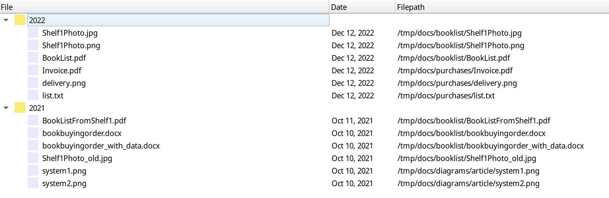

# foldermergeview
foldermergeview is a small app that shows all files in all subfolders of a given list of folders and shows them in a list organized with year. 

## How to use
When you first start `foldermergeview`, it create as a settings file, the contents of which can then be changed to specify which folders `foldermergeview` should look at and which files it should list. 

On linux the settings file is located at `~/.config/ahmet.ac/foldermergeview.conf`

Here is an example settings file:

~~~
[General]
folders=/tmp/docs
runners=[.]txt$:emacs, [.]html$:emacs, [.]rb$:emacs, [.]py$:emacs, [.]cpp$:emacs, [.]hs$:emacs, [.]tex$:emacs, [.]jpg:phototonic, [.]png$:phototonic, [.]svg$:inkscape, [.]ipe$:ipe, [.]pdf$:evince, [.]ps$:evince, [.]eps$:evince, [.]docx$:libreoffice
~~~

This settings file contains two lists: `folders` and `runners`. 

Here the folder `/tmp/docs` is listed as a folder that `foldermergeview` should look at when listing the files. All subfolders of this folder are scanned for files. `foldermergeview` lists all the files that matches either one of the regular expressions in the `runners` list. Notice that the `runners` list is a list composed of strings of the form key:value. Here the key is a regular expression and the value is the name of an executable. If the file matches with the regular expression, `foldermergeview` associates that file with the provided executable. If the user selects the file in the list and presses the `right` arrow key, the executable will be run with the path of the file given as an argument.

## Compilation

`foldermergeview` uses Qt for the user interface and the source code in C++. The repository includes a qtcreator project file for easy compilation.    
